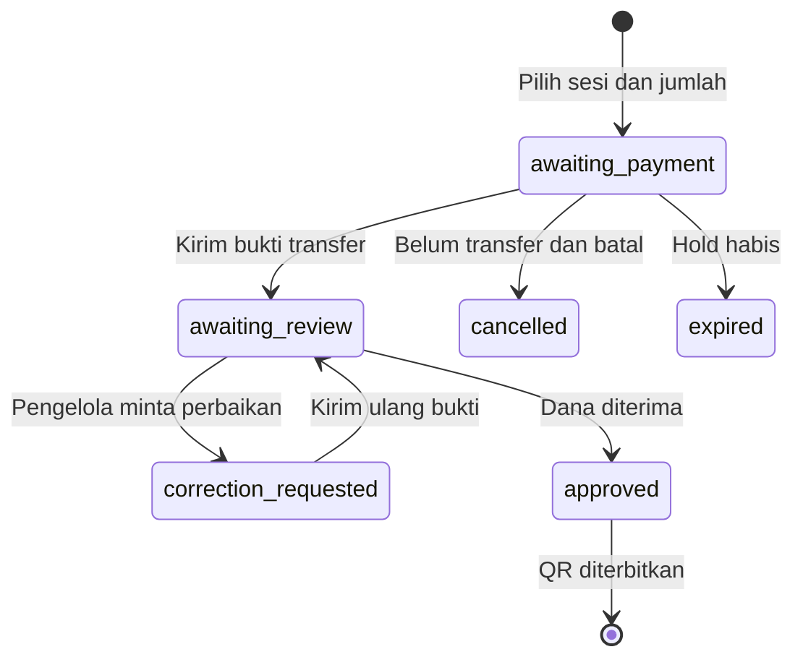

# Pembayaran, kuota dan tiket

## Status order

Sesi gratis langsung approved + QR. Kuota aktif: approved, awaiting_review, correction_requested, serta awaiting_payment dengan expires_at>now. Cancelled/expired tidak memakan kuota. hold default 30 menit; pending proof/correction tidak timeout otomatis, agar dana yang sudah dikirim tidak kehilangan kuota karena pengelola lambat.

## Flow penonton

1. Login customer, pilih satu sesi dan qty 1–6. POST orders dengan idempotency_key (UUID client); Go mengunci sesi dan menyimpan order sebelum membuka pembayaran.
2. Pilih master bank/wallet organizer. Salinan nomor/pemilik/instruksi tersimpan pada payment_snapshot. Edit master setelah itu tidak mengubah order.
3. Transfer melalui aplikasi bank/wallet sendiri. Upload JPG/PNG/WebP≤8 MB sebagai proof privat, lalu **Kirim bukti**. Upload file saja belum mengubah status; submit proof membuat awaiting_review.
4. Jika menutup halaman, detail order dapat dibuka lagi melalui Transaksi & tiket di profil/sidebar. Pilihan metode/status tetap di DB. File yang diupload tetapi belum disubmit perlu dipilih/diupload lagi setelah reload; metadata upload tersimpan, UI draft proof belum dipulihkan otomatis.
5. Bila correction_requested, baca alasan, upload proof baru, kirim ulang pada order yang sama. Tidak membuat order baru.
6. Bila approved, semua tiket tampil di detail order dan Tiket saya; unduh QR atau cetak PDF melalui browser.

Pembatalan hanya awaiting_payment dan proof_id kosong, dengan checkbox belum transfer. Sesudah proof submitted user tidak dapat batal sendiri. Jika hold habis tetapi sudah transfer, hubungi organizer dengan nomor pesanan; UI mengarahkan ke ruang organizer. Tidak ada refund/reconciliation otomatis di v0.1.

## Flow pengelola

Master rekening di /kelola/rekening, dapat bank/wallet dan dinonaktifkan untuk order baru. Jangan menghapus instruksi order lama. Proof submitted/reproof mengirim notifikasi pengelola; order baru yang belum transfer tidak mengirim payment notification.

Queue /kelola/pembayaran → detail → cocokkan mutasi rekening sesungguhnya. **Gambar proof bukan bukti dana masuk.** Approve hanya jika received_funds=true. Approve mengunci order, menerbitkan qty tiket, menambah history dan notifikasi dalam satu transaksi. Pengulangan approve mengembalikan order lama tanpa QR tambahan. Correction perlu alasan 10–500 karakter.

## QR dan kapasitas

Opaque token 256 bit per admission, payload `ruang:ticket:<token>`, tidak memuat PII/harga. Scanner online /kelola/scanner membutuhkan login organizer dan event terpilih. Pilihan kamera hanya setelah tombol ditekan; localhost adalah secure context; browser butuh izin kamera. jsQR membaca frame; fallback salin/ketik token tersedia.

Go mengunci tiket FOR UPDATE, mengecek organizer/event/order approved/checked_at dan window gate dua jam sebelum sesi sampai dua jam setelah sesi berakhir. Check-in pertama atomik menulis waktu+pengelola. Reuse mengembalikan 409. QR event salah 400; organizer lain 403. Mode offline dan multi-staff belum tersedia.

Pembuatan order mengunci event_sessions sebelum menghitung reservasi. Sesama checkout pada satu sesi terserialisasi. Perubahan kapasitas mengambil lock sesi yang sama. Unique(account_id,idempotency_key) dan unique(order_id,ordinal) menjadi lapisan tambahan. Integration test menjalankan delapan checkout bersamaan untuk empat kursi tersisa.

## Checkpoint notifikasi

| Perubahan                     | Customer                             | Organizer      |
| ----------------------------- | ------------------------------------ | -------------- |
| Order dibuat / tiket gratis   | Ya                                   | Tidak          |
| Bukti dikirim / dikirim ulang | Ya                                   | Ya             |
| Perbaikan diminta             | Ya                                   | Tidak tambahan |
| Disetujui, tiket terbit       | Ya                                   | Tidak tambahan |
| Batal / expired               | Ya                                   | Tidak          |
| Unpaid tinggal ≤5 menit       | Ya, sekali per order                 | Tidak          |
| Sesi mulai dalam 24 jam        | Ya bila reminders aktif, sekali/sesi | Tidak          |

Notifikasi disimpan DB dan diperbarui dalam aplikasi tiap 30 detik. Bukan push/email. Notification order tidak bisa dimatikan; prefs events/replies/reminders mengatur notifikasi komunitas dan reminder.

## Pengingat batas pembayaran

Scheduler Go berjalan tiap menit. Pada unpaid aktif yang tersisa paling banyak lima menit, INSERT payment_reminders ON CONFLICT DO NOTHING dan notifikasi dilakukan dalam transaksi yang sama. Proof submitted/correction tidak menerima pengingat unpaid. Pengingat ini wajib seperti status transaksi; tidak bergantung preferensi reminder acara. Handler/refresh order menjalankan expiry, dan scheduler juga mengakhiri hold habis. Tidak ada email/push.

Pemilihan sesi tetap tersimpan dalam query selama redirect login/onboarding. Memilih metode menyimpan snapshot pada order; memilih varian produk memilih opsi pertama yang tersedia. Klik CTA tiket/merch dihitung sebagai klik, bukan pesanan/uang diterima.
